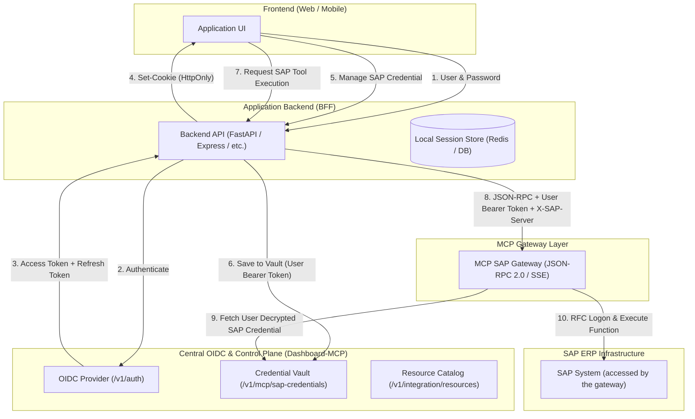

# SPECIFICATION & SYSTEM PROMPT: OIDC AUTHENTICATION, SAP CREDENTIAL VAULT & MCP GATEWAY INTEGRATION

> **Instructions for the AI Agent:**
> You are an expert system architect and full-stack software engineer. Your task is to implement or integrate the end-to-end authentication, credential management, and MCP (Model Context Protocol) SAP Gateway communication described in this document into this application.
> Follow the exact architecture patterns, security boundaries, and API contracts detailed below.

---

## 1. High-Level Architecture Overview

This architecture implements the **Backend-For-Frontend (BFF)** pattern with delegated identity and credential management. The Lumina backend does not use PyRFC or connect directly to SAP; it processes application data and calls the OIDC-protected MCP Gateway for every SAP operation.



### Core Security Rules:
1. **Never store user SAP passwords in the local application database.** All SAP credentials (user, password, connection tokens) must be saved into the Central OIDC Credential Vault.
2. **Never expose raw OIDC JWTs to browser `localStorage` or `sessionStorage`.** Use signed, HTTP-only, secure cookies between the Browser and the BFF.
3. **Every MCP SAP call must carry the active user's OIDC Bearer Token.** The MCP Gateway will introspect the token, verify authorization, and retrieve the user's personal SAP credentials bound to their OIDC subject (`sub`).

---

## 2. Environment Variables & Configuration

The application must configure these connection parameters:

```env
# Central OIDC & Control Plane Base URL
DASHBOARD_OIDC_ISSUER=http://<oidc-host>:4000

# Service token for backend-to-backend catalog discovery (read-only)
DASHBOARD_MCP_API_TOKEN=mcp_sys_live_catalog_token...

# MCP SAP Gateway Endpoint
DASHBOARD_MCP_GATEWAY_URL=http://<gateway-host>:4000/v1/gateway

# Local Session Cookie Settings
SESSION_SECRET=super-secure-32-character-minimum-secret-key
SESSION_EXPIRE_HOURS=24
SESSION_COOKIE_NAME=sap_session

# Lumina application database; the schema name must be read from this variable
DATABASE_URL=postgresql+psycopg://<user>:<password>@<host>:5432/<database>
DATABASE_SCHEMA=dynamic_report
```

---

## 3. Module 1: User Login & Session Exchange (BFF Flow)

### Step 1.1: Frontend to BFF
`POST /api/auth/login`
```json
{
  "username": "john.doe",
  "password": "UserOidcPassword123!"
}
```

### Step 1.2: BFF to Central OIDC
The BFF forwards the credentials to the Central OIDC Issuer:
- **Endpoint:** `POST {DASHBOARD_OIDC_ISSUER}/v1/auth/login`
- **Request Body:**
  ```json
  {
    "username": "john.doe",
    "password": "UserOidcPassword123!"
  }
  ```
- **Success Response (HTTP 200):**
  ```json
  {
    "accessToken": "eyJhbGciOi...",
    "expiresIn": 900,
    "user": {
      "id": "usr_abc123",
      "username": "john.doe",
      "email": "john.doe@company.com",
      "roles": ["user", "finance"]
    }
  }
  ```
  *(Note: OIDC also returns a `refresh_token` cookie in the HTTP response headers).*

### Step 1.3: BFF Session Storage
The BFF creates an internal session record:
1. Generate a unique `session_id` (UUID v4 or cryptographic token).
2. Store `access_token`, `refresh_token`, `expires_at` (now + `expiresIn`), and user profile mapped to `session_id` in Redis or DB.
3. Issue a signed HTTP-only cookie (`sap_session`) containing `session_id`, `sub`, `username`, `roles`.

### Step 1.4: Automatic Token Refresh Interceptor
Before any outgoing call using the user's OIDC token:
```python
def get_valid_user_oidc_token(session_id: str) -> str:
    session = get_session(session_id)
    # If token expires in less than 60 seconds, refresh it
    if session.expires_at <= (datetime.utcnow() + timedelta(seconds=60)):
        new_token, new_refresh, new_exp = refresh_oidc_token(session.refresh_token)
        update_session(session_id, new_token, new_refresh, new_exp)
        return new_token
    return session.access_token

def refresh_oidc_token(refresh_token: str):
    res = httpx.post(
        f"{DASHBOARD_OIDC_ISSUER}/v1/auth/refresh",
        cookies={"refresh_token": refresh_token},
        timeout=5.0
    )
    res.raise_for_status()
    data = res.json()
    new_refresh = res.cookies.get("refresh_token") or refresh_token
    return data["accessToken"], new_refresh, data.get("expiresIn", 900)
```

---

## 4. Module 2: SAP Server Catalog Discovery

To populate the list of available SAP systems in the UI:
- **Endpoint:** `GET {DASHBOARD_OIDC_ISSUER}/v1/integration/resources`
- **Headers:** `Authorization: Bearer {DASHBOARD_MCP_API_TOKEN}`
- **Response Format (the current gateway may return `serverId` without `id`):**
  ```json
  {
    "resources": [
      {
        "serverId": "mcp_sap_server_id",
        "kind": "sap",
        "label": "SAP PRD (Production Client 100)",
        "resource_key": "sap:PRD-100",
        "sid": "PRD",
        "client": "100",
        "environment": "production",
        "is_production": true,
        "aliases": ["prd", "production", "sap-prd"]
      },
      {
        "serverId": "mcp_sap_server_id",
        "kind": "sap",
        "label": "SAP DEV (Development Client 200)",
        "resource_key": "sap:DEV-200",
        "sid": "DEV",
        "client": "200",
        "environment": "development",
        "is_production": false,
        "aliases": ["dev", "development"]
      }
    ]
  }
  ```
- **Filter Rule:** Keep only items where `item.kind == "sap"`. The deployed catalog exposes `serverId` and `resource_key`, but may omit the SAP `connectionId`. Resolve it with the user's bearer token via `GET /v1/mcp/servers/{serverId}/connections`, matching each connection's `resourceKey` to the catalog's `resource_key`. Use the resulting connection `id` for vault writes and the `resource_key` in gateway tool arguments.

---

## 5. Module 3: Delegated User SAP Credential Management

Each user can store their personal SAP username and password for each connection target.

### 5.1. List User Credential Status
Fetch the credentials already configured by the currently logged-in user:
- **Endpoint:** `GET {DASHBOARD_OIDC_ISSUER}/v1/mcp/sap-credentials/mine`
- **Headers:** `Authorization: Bearer {USER_OIDC_ACCESS_TOKEN}`
- **Response Format:**
  ```json
  [
    {
      "connectionId": "conn_sap_prd_100",
      "configured": true,
      "username": "SAP_JOHND"
    }
  ]
  ```
  *(Notice: The password is NEVER returned).*

### 5.2. Save / Update User Credential
When the user submits credentials in the frontend:
- **Endpoint:** `PUT {DASHBOARD_OIDC_ISSUER}/v1/mcp/sap-credentials/{connectionId}`
- **Headers:**
  - `Authorization: Bearer {USER_OIDC_ACCESS_TOKEN}`
  - `Content-Type: application/json`
- **Request Body:**
  ```json
  {
    "username": "SAP_JOHND",
    "password": "MySecretSapPassword2026!"
  }
  ```
- **Status:** HTTP 200 OK or 204 No Content.

### 5.3. Delete User Credential
- **Endpoint:** `DELETE {DASHBOARD_OIDC_ISSUER}/v1/mcp/sap-credentials/{connectionId}`
- **Headers:** `Authorization: Bearer {USER_OIDC_ACCESS_TOKEN}`
- **Status:** HTTP 200 OK or 204 No Content.

### 5.4. Connection ID Resolution Helper
To resolve user input aliases (e.g. `"prd"`, `"PRD-100"`, `"conn_sap_prd_100"`):
```python
def resolve_connection_id(credential_rows: list[dict], target: str) -> str:
    wanted = str(target or "").strip().lower()
    for row in credential_rows:
        conn = row.get("connection") or {}
        cid = str(row.get("connectionId") or row.get("connection_id") or conn.get("id") or "").strip()
        names = {
            str(name).strip().lower() for name in [
                row.get("target"), row.get("alias"), row.get("name"),
                row.get("connectionName"), row.get("resourceKey"),
                conn.get("resourceKey"), conn.get("name")
            ] if name
        }
        for alias in (row.get("aliases") or conn.get("aliases") or []):
            names.add(str(alias).strip().lower())
        
        # Strip 'sap:' prefixes
        names.update(n.split(":", 1)[1] for n in tuple(names) if n.startswith("sap:"))
        
        if wanted == cid.lower() or wanted in names:
            return cid
            
    raise ValueError(f"Target SAP '{target}' not found in OIDC connections.")
```

---

## 6. Module 4: Calling MCP SAP Gateway

The MCP Gateway uses standard **JSON-RPC 2.0** over HTTP.

### 6.1. Header Contract
Every tool invocation call to `DASHBOARD_MCP_GATEWAY_URL` MUST include:
| Header Name | Value | Description |
|---|---|---|
| `Authorization` | `Bearer <USER_OIDC_ACCESS_TOKEN>` | Active user identity. |
| `X-SAP-Server` | `<target_alias_or_sid>` (e.g., `prd` or `PRD`) | Tells gateway which SAP target to connect to. |
| `X-SAP-Language` | `EN` or `ID` | Logon language for RFC session. |
| `Content-Type` | `application/json` | Standard JSON payload. |

### 6.2. Concurrency Safety
Send the target in `X-SAP-Server` on **every** gateway call. The gateway must resolve user identity and target per request and keep that context isolated across concurrent users. Do not rely on `set_active_server` or a process-local BFF lock: a lock cannot protect multiple backend workers or gateway instances. If the deployed gateway requires mutable active-server state, fix that contract in the gateway before enabling concurrent use.

### 6.3. JSON-RPC 2.0 Request Payload
```json
{
  "jsonrpc": "2.0",
  "id": 1,
  "method": "tools/call",
  "params": {
    "name": "mcp-sap__read_table",
    "arguments": {
      "resource_key": "sap:dev",
      "table": "MARA",
      "fields": ["MATNR", "MTART", "MEINS"],
      "rowcount": 5
    }
  }
}
```

### 6.4. Mutation BAPIs
Lumina's reporting endpoints are read-only by default. Any later SAP write feature needs a separate authorized backend operation and a gateway tool that performs the BAPI plus commit or rollback atomically in the **same RFC session**. The BFF cannot guarantee this with separate stateless JSON-RPC calls. Do not infer write permission from a BAPI name.

---

## 7. Module 5: RFC Error Handling & Troubleshooting Guidelines

> [!CRITICAL]
> **Rule: Never claim "SAP is Offline" when the issue is an authentication or credential failure.**

When the MCP Gateway returns an SAP or gateway error, classify it accurately:

### Error Classification Table:
| Error Pattern in Error Text | Underlying Cause | User-Facing Actionable Translation |
|---|---|---|
| `RFC_LOGON_FAILURE` / `rc: 103` / `Password logon no longer possible` | SAP User / Password incorrect or expired in SAP | *"Logon ke SAP [Target] gagal: Username atau password akun SAP Anda salah atau kedaluwarsa. Silakan perbarui kredensial Anda di menu Pengaturan Kredensial SAP."* |
| `Account locked` / `User locked` | Akun SAP terkunci (misal 3x salah password) | *"Akun SAP Anda pada sistem [Target] sedang terkunci. Silakan hubungi tim Basis/Admin SAP untuk membuka kunci akun."* |
| `No RFC authorization for function` / `S_RFC` | Akun SAP tidak memiliki objek otorisasi `S_RFC` untuk function module tersebut | *"Akun SAP Anda tidak memiliki izin otorisasi untuk menjalankan modul fungsi ini ([ToolName]). Hubungi tim SAP Security."* |
| `Connect to SAP gateway failed` / `WSAECONNREFUSED` / `timeout` | Gangguan jaringan nyata ke host/port SAP | *"Tidak dapat terhubung ke server SAP [Target]. Terjadi gangguan koneksi jaringan atau port SAP sedang tidak dapat dijangkau."* |
| `Akses kredensial SAP ditolak OIDC` / `HTTP 401/403` | Sesi OIDC pengguna kedaluwarsa | *"Sesi autentikasi Anda telah kedaluwarsa. Silakan login kembali ke aplikasi."* |

---

## 8. Reference Implementation Skeleton (FastAPI / Python)

```python
import os
import httpx
from fastapi import FastAPI, Depends, HTTPException, Request, Response
from pydantic import BaseModel

app = FastAPI(title="App with OIDC & SAP MCP Gateway")

OIDC_BASE = os.environ["DASHBOARD_OIDC_ISSUER"]
MCP_GATEWAY_URL = os.environ["DASHBOARD_MCP_GATEWAY_URL"]

# 1. Dependency to extract User OIDC Token from BFF session
async def get_user_oidc_token(request: Request) -> str:
    # Resolve from Redis/DB session using the request's HTTP-only cookie
    token = request.state.user_oidc_token
    if not token:
        raise HTTPException(status_code=401, detail="Sesi OIDC tidak valid. Silakan login kembali.")
    return token

# 2. Save Credential Endpoint
class SaveCredentialDto(BaseModel):
    connection_id: str
    username: str
    password: str

@app.post("/api/sap-credentials")
async def save_credential(dto: SaveCredentialDto, token: str = Depends(get_user_oidc_token)):
    url = f"{OIDC_BASE}/v1/mcp/sap-credentials/{dto.connection_id}"
    payload = {"username": dto.username, "password": dto.password}
    
    async with httpx.AsyncClient(timeout=15) as client:
        res = await client.put(url, json=payload, headers={"Authorization": f"Bearer {token}"})
        if res.status_code not in (200, 204):
            raise HTTPException(status_code=res.status_code, detail="Gagal menyimpan kredensial ke OIDC.")
            
    return {"success": True, "message": "Kredensial SAP berhasil disimpan terenkripsi."}

# 3. Bounded read operation; tool names are chosen by the backend
class ReadTableDto(BaseModel):
    target: str
    table_name: str
    fields: list[str]
    rowcount: int = 100

@app.post("/api/sap/read-table")
async def read_sap_table(dto: ReadTableDto, token: str = Depends(get_user_oidc_token)):
    # Resolve target against the catalog and user-visible connection list;
    # validate table/fields and apply per-user authorization before the call.
    if not 1 <= dto.rowcount <= 1000:
        raise HTTPException(status_code=422, detail="Batas baris tidak valid.")
    resource_key = lookup_authorized_resource_key(dto.target, token)  # See Module 2; implement in BFF.
    headers = {
        "Authorization": f"Bearer {token}",
        "X-SAP-Server": dto.target,
        "X-SAP-Language": "EN",
        "Content-Type": "application/json"
    }
    rpc_payload = {
        "jsonrpc": "2.0",
        "id": 1,
        "method": "tools/call",
        "params": {
            "name": "mcp-sap__read_table",
            "arguments": {
                "resource_key": resource_key,
                "table": dto.table_name,
                "fields": dto.fields,
                "rowcount": dto.rowcount
            }
        }
    }
    
    async with httpx.AsyncClient(timeout=30) as client:
        res = await client.post(MCP_GATEWAY_URL, json=rpc_payload, headers=headers)
        res.raise_for_status()
        res_json = res.json()
        
    return res_json
```

---

## 9. Verification & Testing Checklist

When implementing this architecture in your project, verify these test cases:
- [ ] **Login Test:** User logs in with Central OIDC credentials, receives HTTP-only cookie, and BFF successfully stores `access_token` and `refresh_token`.
- [ ] **Catalog Test:** BFF calls `/v1/integration/resources` and successfully receives all available SAP targets (PRD, DEV, etc.).
- [ ] **Credential Save Test:** User saves SAP username & password for target `PRD`; verify that `GET /v1/mcp/sap-credentials/mine` reports `hasCredential: true`.
- [ ] **Tool Call Test:** Execute a simple read tool (e.g. `read_table` or RFC ping) with valid credentials; verify data returns from SAP.
- [ ] **Bad Password Test:** Intentionally submit wrong SAP password; verify the system returns a specific `RFC_LOGON_FAILURE` error translation and **does not claim the server is offline**.
- [ ] **Refresh Rotation Test:** Wait for access token expiry (900s) and verify that the next request automatically refreshes the token without logging out the user.
